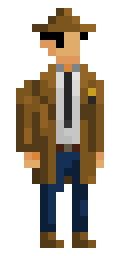

Hi there!

My name is Lam Van Quoc (Constance Anderson)
==================================================

> Game Developer | Pixel Art Hobbyist

I am a 22-ish __Game Developer__ with _Unity Engine_ who hails from a small but beautiful country in South-east Asia, __Vietnam__ 🇻🇳. I am also a __Pixel Art Hobbyist__, which allows me to create graphic assets for games I develop.

I have been studying __Unity Engine__ for ___over 2 years___ now, and have developed various of games for _PC_ and _Mobile_ under my own studio - __CST Games__ or collaborated with other friends of mine, although most of them have not really been finished yet because I'm currently a last year student at my university, so a significant percentage of my time must be spent on university/graduation works.

But beside all that, I really like participating in Game Jams, because it's a good place to show off what I've learnt over the years, and also to learn more from other developers as well. Most recently, I have participated in __Ludum Dare 55__ along with my 2 other friends with our entry [__Necrogirl__]( https://ldjam.com/events/ludum-dare/55/necrogirl), we got pretty good scores overall after the jam concluded.

As of now, I'm seeking a suitable ___internship___ or ___entry-level___ position as a __Unity/Game Developer__ to further enhance my knowledge and accumulate more experience. So if you have an offer for me at you company, team or organization, feel free to contact me at ___lvq13302@gmail.com___

_TLDR_, this is a brief description of me:
- 💻  I'm a last year university student, with nearly _2 years_ of self-taught experience in game development with __Unity Engine__.
- 🎮  I really like participate in Game Jams, because I can put my game-making skill to its limit!
- 🌍  I hail from __Vietnam__, Earth, Milky Way Galaxy.
- 📫  Contact me at ___lvq13302@gmail.com___
- 🚀  I'm currently working on [__our Ludum Dare 55 entry - Necrogirl.__](http://github.com/constance012/Necrogirl)
- 🏢  I'm seeking an ___internship___ or ___entry-level___ position as a Unity/Game Developer.
- 🧠  In the meantime, I'm also learning more about __Pixel Art__, and __advanced stuff__ in Unity such as Multiplayer, Networking, Procedural Generation, Probuilder,...
- 🚗  Lastly, I'm a sucker for cars and aviation and an appreciator of US-UK music.

### My skills:

### My IDE, software:

### You can find me on:

### My stats

<!---
constance012/constance012 is a ✨ special ✨ repository because its `README.md` (this file) appears on your GitHub profile.
You can click the Preview link to take a look at your changes.
--->
